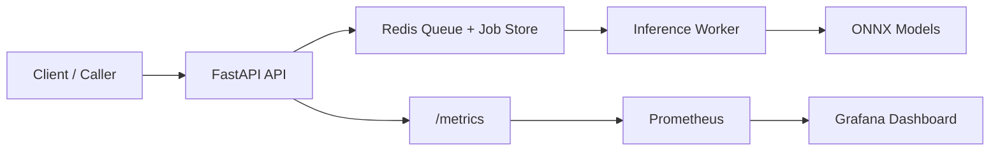
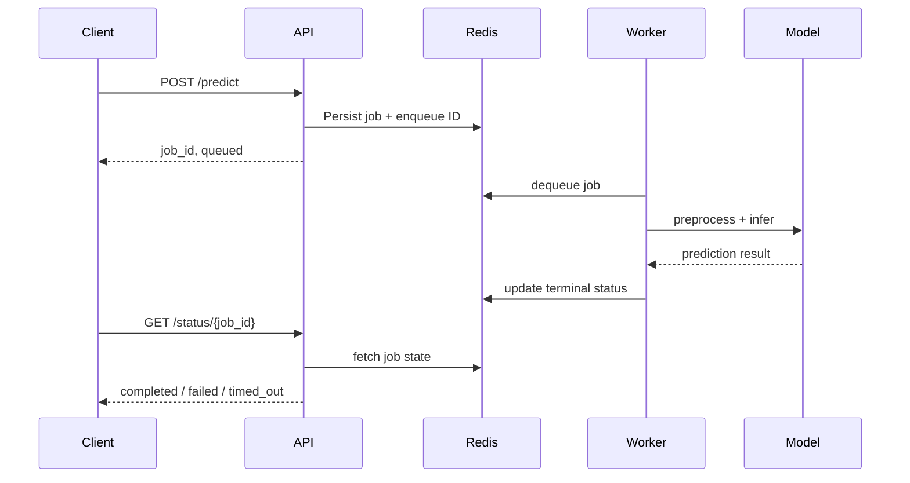
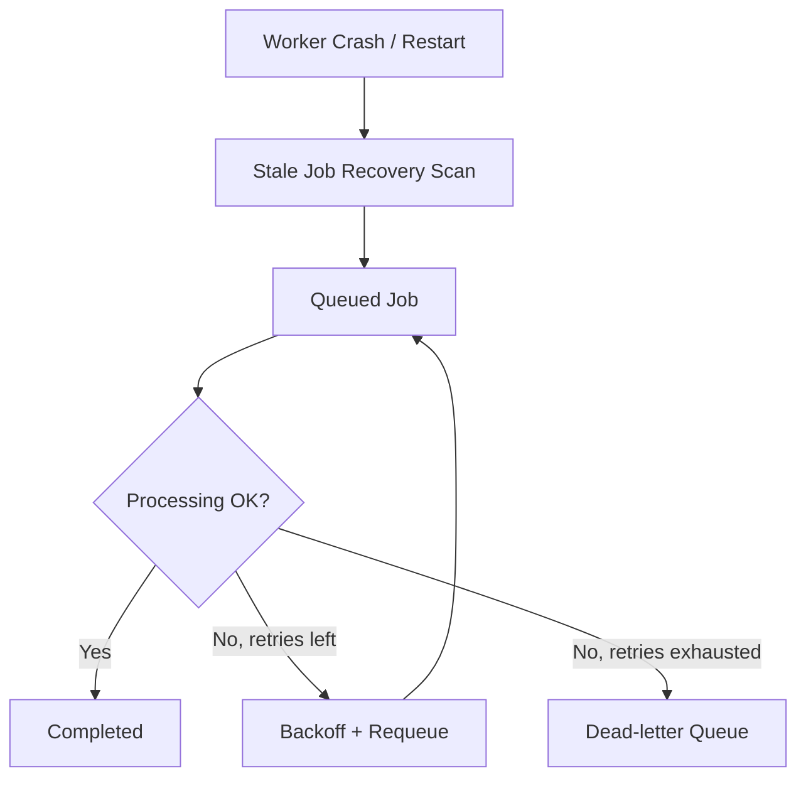
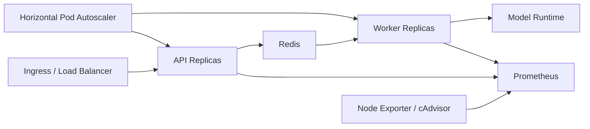

# VisionFlow Architecture

## System Design

```mermaid
flowchart LR
  Client["Client / Caller"] --> API["FastAPI API"]
  API --> Redis["Redis Queue + Job Store"]
  Redis --> Worker["Inference Worker"]
  Worker --> Models["ONNX Models"]
  API --> Metrics["/metrics"]
  Metrics --> Prometheus["Prometheus"]
  Prometheus --> Grafana["Grafana Dashboard"]
```

## Request Lifecycle

```mermaid
sequenceDiagram
  participant C as Client
  participant A as API
  participant R as Redis
  participant W as Worker
  participant M as Model

  C->>A: POST /predict
  A->>R: Persist job + enqueue ID
  A-->>C: job_id, queued
  W->>R: dequeue job
  W->>M: preprocess + infer
  M-->>W: prediction result
  W->>R: update terminal status
  C->>A: GET /status/{job_id}
  A->>R: fetch job state
  A-->>C: completed / failed / timed_out
```

## Queue Architecture

```mermaid
flowchart TD
  Input["Queued Job"] --> Retry{"Processing OK?"}
  Retry -- Yes --> Done["Completed"]
  Retry -- No, retries left --> Backoff["Backoff + Requeue"]
  Backoff --> Input
  Retry -- No, retries exhausted --> DLQ["Dead-letter Queue"]
  Crash["Worker Crash / Restart"] --> Recover["Stale Job Recovery Scan"]
  Recover --> Input
```

## Scaling Architecture

```mermaid
flowchart LR
  Ingress["Ingress / Load Balancer"] --> APIReplicas["API Replicas"]
  APIReplicas --> Redis["Redis"]
  Redis --> WorkerReplicas["Worker Replicas"]
  WorkerReplicas --> Models["Model Runtime"]
  HPA["Horizontal Pod Autoscaler"] --> APIReplicas
  HPA --> WorkerReplicas
  NodeMetrics["Node Exporter / cAdvisor"] --> Prom["Prometheus"]
  APIReplicas --> Prom
  WorkerReplicas --> Prom
```
